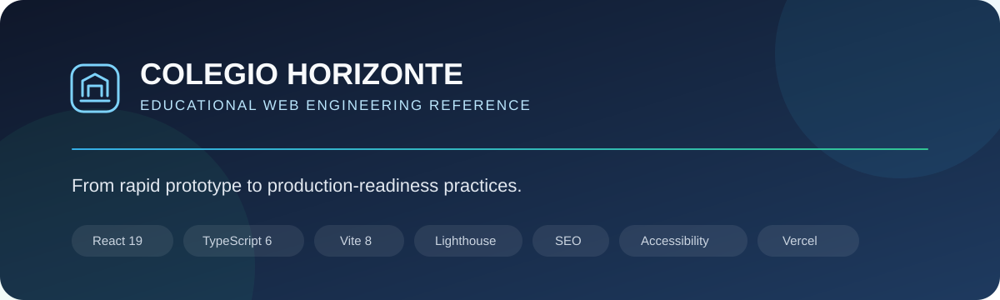
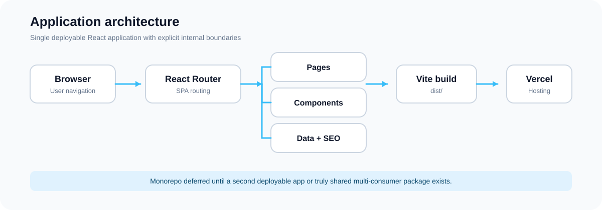
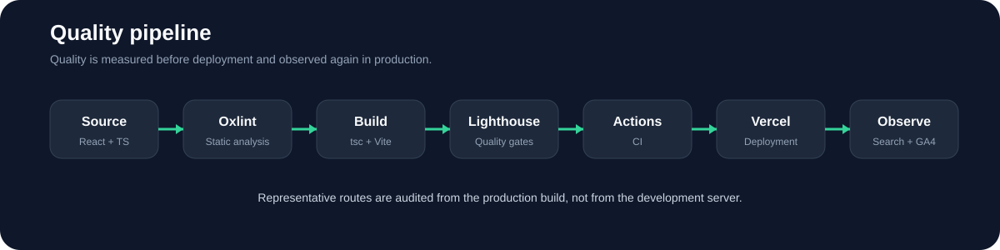

<p align="center">
  
</p>

# Colegio Horizonte

Colegio Horizonte is a fictitious institutional website built as an educational and portfolio project. The school, people, addresses, contact details, statistics, news and institutional claims shown in the interface are demonstration data.

The purpose of this repository is not to present a real school. Its purpose is to document how a frontend can evolve from a rapidly assembled prototype into a more disciplined web engineering project with explicit work on architecture, accessibility, performance, SEO, security, analytics readiness, legal transparency, continuous integration and deployment.

> **Project status:** active engineering exercise. The application is intentionally improved in public so architectural decisions, regressions and quality work remain observable.

## What this project demonstrates

- Responsive institutional UI built with React and TypeScript.
- SPA routing and route-level code splitting.
- Reusable layout and interface components.
- Centralized static content and navigation data.
- Per-route metadata, canonical links and social metadata.
- `robots.txt` and `sitemap.xml` for crawler discovery.
- Security headers and Content Security Policy.
- Keyboard navigation and accessibility-oriented structure.
- Lighthouse CI as a repeatable quality gate.
- Google Search Console verification readiness.
- Consent-gated Google Analytics 4 readiness.
- Vercel-compatible deployment without coupling application logic to Vercel APIs.
- Explicit legal, licensing and third-party asset provenance documentation.

## Architecture

<p align="center">
  
</p>

This repository intentionally remains a **single modular application**, not a monorepo.

A monorepo would currently add workspace and package-management overhead without representing a real boundary: there is one deployable React application and no shared package with multiple consumers. A migration becomes justified when the project gains, for example, an independently deployable API or administration application, or a shared package consumed by more than one application.

Current source organization:

```text
src/
├── assets/                 Static resources imported by the application
├── components/
│   ├── analytics/          Consent and optional telemetry integration
│   ├── layout/             Navbar, footer, SEO and global layout behavior
│   └── ui/                 Reusable interface elements
├── data/                   Static institutional and navigation data
├── pages/                  Route-level views
├── utils/                  Focused browser-side utilities
├── AppRouter.tsx           Route composition
└── main.tsx                Application entry point
```

Repository-level engineering concerns live outside `src/`:

```text
.github/workflows/          Continuous integration
docs/assets/readme/         Project-owned SVG documentation assets
docs/superpowers/           Architecture specification and implementation plan
docs/THIRD_PARTY_ASSETS.md  Asset provenance and licensing
lighthouserc.json           Automated Lighthouse policy
vercel.json                 Deployment and HTTP security headers
```

## Technology stack

| Area | Technology | Role |
|---|---|---|
| UI | React 19 | Component model and rendering |
| Language | TypeScript 6 | Static typing and build-time verification |
| Build | Vite 8 | Development server and production bundling |
| Styling | Tailwind CSS 4 | Design tokens and utility-driven styling |
| Routing | React Router 7 | SPA navigation |
| Motion | Framer Motion 12 | Controlled interface transitions |
| Icons | Lucide React | SVG-based interface iconography |
| Metadata | React Helmet Async | Route-level document metadata |
| Static analysis | Oxlint | Fast linting |
| Quality audit | Lighthouse CI | Performance, accessibility, best-practice and SEO gates |
| CI | GitHub Actions | Repeatable repository verification |
| Deployment target | Vercel | Recommended preview and production hosting for the demo |

## Quality pipeline

<p align="center">
  
</p>

The project treats the production build as the reference artifact for quality auditing.

Initial Lighthouse CI policy:

| Category | Initial gate |
|---|---:|
| Performance | 0.85 warning threshold |
| Accessibility | 0.95 required |
| Best Practices | 0.95 required |
| SEO | 0.95 required |

The objective is not to optimize for a decorative `100/100`. The objective is to establish a baseline, identify meaningful problems and prevent regressions as the project changes.

Representative routes are audited because a SPA can have materially different behavior across pages even when they share one bundle.

## Available routes

```text
/
/nosotros
/oferta-academica
/admision
/noticias
/noticias/:id
/calendario
/documentos
/galeria
/preguntas-frecuentes
/contacto
/privacidad
/terminos
```

Unknown routes render the application 404 view.

## SEO and Search Console

The application already centralizes route metadata with `react-helmet-async`. The SEO layer manages document titles, descriptions, canonical URLs, Open Graph metadata and Twitter card metadata.

Crawler support includes:

- `public/robots.txt`
- `public/sitemap.xml`
- canonical URLs
- route-specific metadata

Google Search Console verification is environment-driven. No verification token is committed to the repository.

```bash
VITE_GOOGLE_SITE_VERIFICATION=your-verification-value
```

When the variable is absent, the verification meta tag is not emitted.

## Analytics and privacy

Google Analytics 4 support is optional and disabled by default.

```bash
VITE_GA_MEASUREMENT_ID=G-XXXXXXXXXX
```

The measurement script is loaded only when both conditions are true:

1. a GA4 measurement ID is configured; and
2. the visitor explicitly accepts analytics in the browser.

A declined choice prevents analytics initialization. The decision is stored locally in the browser so the application does not repeatedly request the same choice.

No Google identifier is treated as a secret, but project-specific IDs remain environment configuration rather than hard-coded source data so the same repository can be deployed in different environments.

## Accessibility

Accessibility work in this project includes semantic page structure, a keyboard skip link, explicit iframe titles, responsive interaction patterns and Lighthouse accessibility auditing.

Lighthouse is not considered a complete accessibility test. Automated checks are used as a regression detector and should be complemented by keyboard-only review and manual inspection of focus order, labels, contrast and dynamic interactions.

## Security

Deployment configuration includes defensive HTTP headers such as:

- `X-Frame-Options`
- `X-Content-Type-Options`
- `Referrer-Policy`
- `Permissions-Policy`
- `Strict-Transport-Security`
- `Content-Security-Policy`

The Content Security Policy is intentionally restrictive. External origins are added only when required by a documented feature such as fonts, embedded maps or consent-gated analytics.

## Legal pages

The application includes:

- `/privacidad`
- `/terminos`

These pages are demonstration implementations and explicitly distinguish the fictitious school content from the real behavior of this repository and deployed demo.

When analytics is enabled, the privacy page describes the optional measurement behavior and browser-side consent storage.

## Visual asset policy

Emoji are not used as interface or README iconography.

The preferred visual hierarchy is:

1. Lucide React for general UI icons.
2. Project-owned SVG for diagrams and repository presentation.
3. Third-party vectors only when they provide specific informational value.

Asset provenance is recorded in [`docs/THIRD_PARTY_ASSETS.md`](docs/THIRD_PARTY_ASSETS.md).

## Local development

Requirements:

- Node.js compatible with the dependencies in `package.json`.
- npm.

Install dependencies:

```bash
npm ci
```

Start the development server:

```bash
npm run dev
```

Create the production build:

```bash
npm run build
```

Preview the production build locally:

```bash
npm run preview
```

Run static analysis:

```bash
npm run lint
```

Run the combined local quality checks:

```bash
npm run quality
```

Run Lighthouse CI against the production build:

```bash
npm run lighthouse:ci
```

## Environment configuration

Copy the example file when an integration is needed:

```bash
cp .env.example .env.local
```

Supported optional variables:

```text
VITE_SITE_URL
VITE_GOOGLE_SITE_VERIFICATION
VITE_GA_MEASUREMENT_ID
```

The application remains functional when all three are unset.

## Deployment

Vercel is the recommended deployment target for the educational/non-commercial version because it integrates naturally with GitHub and Vite and can provide preview deployments for branches and pull requests.

Recommended lifecycle:

```text
feature branch
    -> GitHub pull request
    -> Vercel preview
    -> quality review
    -> merge to main
    -> Vercel production
    -> Search Console / analytics observation
```

The application is not architecturally dependent on Vercel. `npm run build` produces the standard static artifact in `dist/`, allowing migration to another static hosting provider later.

## Continuous integration

GitHub Actions verifies the repository through install, lint, TypeScript/Vite build and Lighthouse CI. A failed quality gate should be investigated as a regression rather than bypassed without explanation.

## Project roadmap

Current engineering direction:

- establish and record real Lighthouse baselines;
- improve Core Web Vitals where measurements identify bottlenecks;
- expand manual accessibility verification;
- deploy a stable public Vercel environment;
- connect Search Console after a stable deployment URL exists;
- configure GA4 only when measurement is actually required;
- keep legal documentation aligned with real application behavior;
- consider monorepo migration only when new deployable boundaries justify it.

## Fictitious content disclaimer

`Colegio Horizonte` is not presented as a real educational institution. Names, addresses, people, enrollment figures, historical claims, contact details, documents and news used by the interface are fictional demonstration data unless a source is explicitly identified otherwise.

Do not use this repository as authoritative institutional, legal or educational information.

## License

This repository is **source-available for portfolio and educational reference; it is not open-source software**.

The project-owned source code, documentation, design and SVG assets are distributed under the proprietary terms in [`LICENSE`](LICENSE). Public visibility permits inspection, but does not grant general permission to copy, redistribute, rebrand, deploy derivative versions or commercially exploit the project.

Third-party dependencies and assets retain their respective licenses.

## Engineering documentation

- [Production-readiness design](docs/superpowers/specs/2026-08-24-production-readiness-design.md)
- [Production-readiness implementation plan](docs/superpowers/plans/2026-08-24-production-readiness.md)
- [Third-party asset provenance](docs/THIRD_PARTY_ASSETS.md)
- [Functional audit](auditoria-funcional.md)
- [Client-experience audit](AUDITORIA_EXPERIENCIA_CLIENTE.md)
- [Project bibliography](bibliografia.md)
